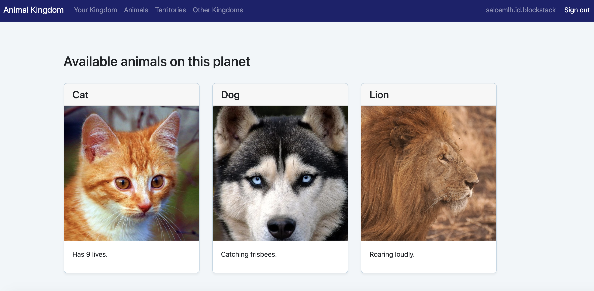

# Introduction

This is a hackathon boilerplate for a new Blockstack application created by [Major League Hacking][mlh-github] in partnership with Blockstack. It is for hackers looking to get started quickly on a new hackathon project using the Blockstack environment.

You are going to build a Decentralized Application (DApp) called Animal Kingdom. Animal Kingdom is a DApp for the web. Users log in and create an animal persona that rules over a specific territory. The combination of persona and territory is a kingdom. Once you create a kingdom, you can add subjects from other kingdoms.
 
The Animal Kingdom interacts with two Blockstack services, the [Blockstack Browser](https://browser.blockstack.org) and the [Gaia data storage hub](https://hub.blockstack.org/). The Blockstack Browser is in itself a DApp. The storage hub is purely a service without user-facing functionality.

Preview the [completed version](http://hackp.ac/animal-kingdom) of this application for yourself by using your Blockstack ID. To learn more about this project complete Blockstacks [Zero to DApp tutorial](http://hackp.ac/zerotodapp).

## Prerequisites

This project requires the following tools:

- Blockstack ID (Identity) - To test your Animal Kingdom
- NPM - A Node.js package manager used to install dependencies.

To get started, install NPM on your local computer if you don't have them already.

## Getting Started

**Step 1. Create a Blockstack ID**

Open the [Blockstack web application in your browser](http://hackp.ac/blockstack-create).

Blockstack will will prompt you to create or restore an ID.

**Step 2. Install Node Package Manager (NPM).**

The Animal Kingdom uses React, Babel, and many other components. You’ll use the `npm` command to install these packaged components.

Check if you have `npm` installed by entering the following command in your terminal, and see if you get a response back.

```
npm -v
```

If `npm` is not installed, you can download it [here](https://www.npmjs.com/get-npm)

**Step 3. Clone the Animal Kingdom code into a fresh folder**

Open your terminal if you haven't already and enter the command below to clone the current repository.

```
$ git clone https://github.com/MLH/mlh-hackathon-blockstack-starter
$ cd mlh-hackathon-blockstack-starter
```

**Step 4. Install Dependencies**

Next, we need to install the project dependencies, which are listed in `package.json`.

```
$npm install
```

In the project directory, you can run 

```
npm start
```

Open http://localhost:3000 to view it in the browser.

The default port for our app is `3000`, but you may need to update this if your setup uses a different port or if you're hosting your app somewhere besides your local machine.

The app will automatically reload if you make changes to the code. You will see the build errors and warnings in the console.

**Step 5. Explore the Animal Kingdom**

From the initial Animal Kingdom screen, choose an animal persona and a territory, and press **done** at the bottom of the page.

The Animal Kingdom makes a call to the Gaia hub to store your selection, and returns to your kingdom page. If you have problems, refresh the page and click Your Kingdom in the menu. Spend a little time exploring the application. For example, you could edit your animal or visit the other pages such as **Animals** or **Territories**.



Go back to your terminal where your application is running.
Press `CTRL-C`to stop the application.

**Step 6. Customizing your Animal Kingdom**

The Animal Kingdom application has two major components, React and Blockstack. React is used to build all the web components and interactions. You could replace React with any framework that you like; Blockstack is web framework agnostic. The `blockstack.js` library is all a hacker needs to create a DApp. It grants the application the ability to authenticate a Blockstack identity and to read and write to the user’s data stored in a Gaia hub.

# Where to go next

You learned about the Blockstack platform and why it makes Blockchain development a painless process by encapsulating the complexity of the blockstack backend. You have set up a typical development environment for developing a Blockstack web application and ran the Animal Kingdom application locally.

If you would like to customize the Animal Kingdom code follow the Blockstack [Zero to DApp tutorial](https://docs.blockstack.org/develop/zero_to_dapp_3.html) to get started.

# App Mining

Any app built with Blockstack during a hackathon that successfully registers for the App Mining program within two weeks of the event will receive an additional $500 reward. Find your hackathon [here](hackp.ac/blockstack)

To be eligible, your app must use Blockstack technology and be publicly accessible. If you have an eligible app, you can register it for [App Mining here](http://hackp.ac/blockstack-mining). 

# Structure

NAME | DESCRIPTION
------------ | -------------
`README.md` | Contains a quick reference for building and running hacker starter kit containing the Animal Kingdom Code.
`package.json` | An NPM project file.
`config` | Environment configuration files written in Javascript.
`public` | Files that are copied into the root of the site you are building.
`scripts` | NPM scripts used to do common tasks in the project.
`src` | React source code for the site.  This contains configuration files.


# Resources
* Visit the [Blockstack forum](https://forum.blockstack.org/). This is a valuable resource to learn about the questions that other developers have now or have had in the past.
* Complete the [Zero to DApp Tutorial](http://hackp.ac/zerotodapp)
* Visit your [Hackathon Blockstack Page](https://hackp.ac/blockstack) for additional resources & prizes.


# Code of Conduct

We enforce a Code of Conduct for all maintainers and contributors of this Guide. Read more in [CONDUCT.md][mlh-conduct].

# License

The Hackathon Starter Kit is open source software [licensed as MIT][mlh-license].

[mlh-github]: https://github.com/jekyll/jekyll/blob/master/CONDUCT.markdown
[mlh-conduct]: https://github.com/MLH/mlh-hackathon-nodejs-starter/blob/master/docs/CONDUCT.md
[mlh-license]: https://github.com/MLH/mlh-hackathon-nodejs-starter/blob/master/LICENSE.md

# Credits

Thank you to our partners Blockstack for providing an in depth [tutorial](http://hackp.ac/zerotodapp) and resources for hackers to use.
